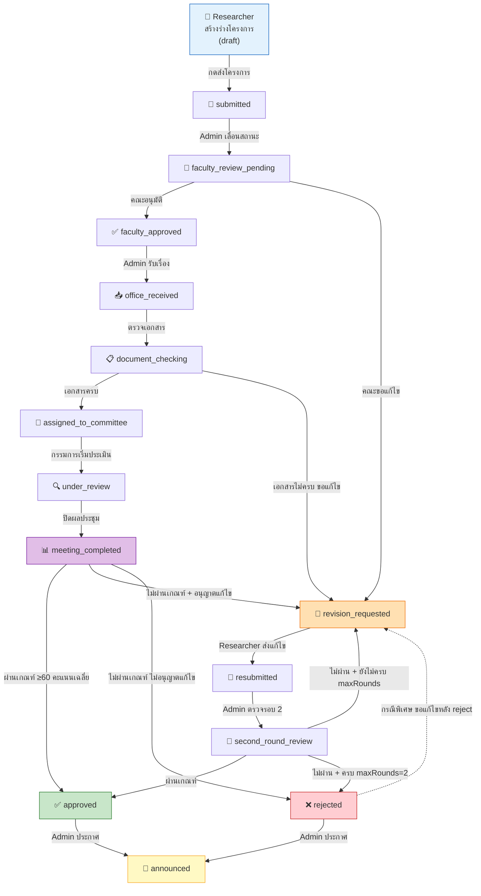
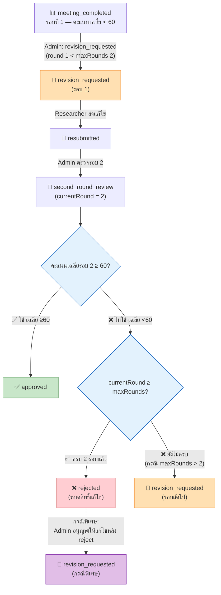
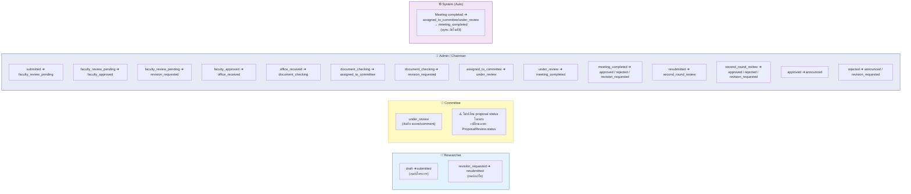
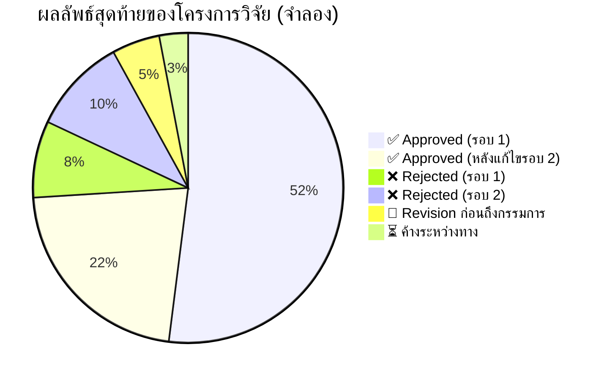
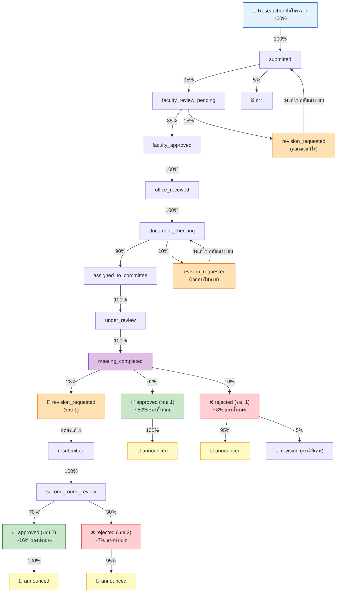
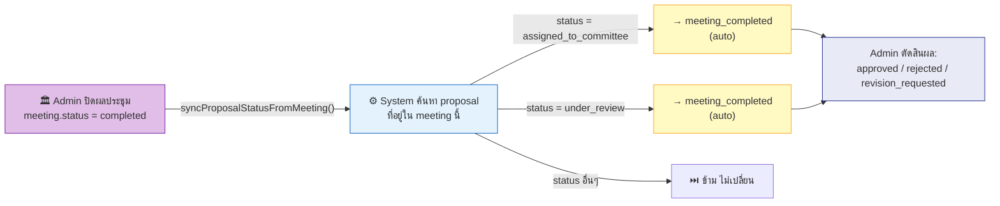

# Research Proposal Workflow Status Architecture

## 1) วัตถุประสงค์เอกสาร
เอกสารนี้สรุปสถาปัตยกรรมการไหลของสถานะโครงการวิจัย (Proposal Status Workflow)
โดยเน้นมุมมองเชิงระบบสำหรับ Role หลัก ได้แก่:
- Researcher
- Committee
- Admin
- Chairman

ครอบคลุมทั้งฝั่ง Frontend (การแสดงผลและการเลือกสถานะ) และ Backend (Business Rule ที่ enforce จริง)

---

## 2) ขอบเขตระบบที่เกี่ยวข้อง

### 2.1 Frontend (Vue)
โมดูลหลักที่เกี่ยวข้องกับสถานะ
- Admin Settings (Workflow tab / Read-only status map)
- Admin Dashboard
- Admin Proposal List
- Admin Proposal Detail
- Committee Project Proposal
- Router guard ตาม role

### 2.2 Backend (Node.js)
โมดูลหลักที่เป็น source of truth
- Proposal routes/controllers/services
- Meeting service (sync status จากผลประชุม)
- Settings service (workflow policy)

---

## 3) องค์ประกอบสถาปัตยกรรม

### 3.1 Data Model (แกนสถานะ)
Proposal มี field หลักสำหรับ workflow ได้แก่:
- currentStatus
- currentRound
- committeeIds
- requiresRevision
- approvedAt / rejectedAt / announcedAt

Status constants หลักในระบบ
- draft
- submitted
- faculty_review_pending
- faculty_approved
- office_received
- document_checking
- assigned_to_committee
- under_review
- meeting_completed
- revision_requested
- resubmitted
- second_round_review
- approved
- rejected
- announced

### 3.2 Transition Engine
Backend ใช้ map ALLOWED_TRANSITIONS เพื่อบังคับสถานะที่เปลี่ยนได้
พร้อม validation policy ก่อนอนุมัติ/เปลี่ยนรอบ

### 3.3 Policy Engine
ค่ากำหนดจาก settings
- minScore (default 60)
- minCommittee (default 3)
- maxRounds (default 2)
- allowRevisionAfterMeeting (default true)

### 3.4 Event + Notification Layer
เมื่อเปลี่ยนสถานะ จะบันทึก
- ProposalStatusLog
และสร้าง
- In-app notification
- Workflow email (ตาม event ที่รองรับ)

---

## 4) Role-based Workflow Behavior

## 4.1 Researcher
หน้าที่หลัก
- สร้างร่างโครงการ
- ส่งโครงการ
- ส่งแก้ไขใหม่เมื่อได้รับคำขอแก้ไข

ผลลัพธ์ด้านสถานะเมื่อทำงานเสร็จ
- ส่งโครงการ: draft -> submitted
- ส่งแก้ไขใหม่: revision_requested -> resubmitted

ข้อสังเกต
- Researcher ไม่สามารถเปลี่ยนสถานะปลายทางแบบอนุมัติ/ปฏิเสธได้

## 4.2 Committee
หน้าที่หลัก
- บันทึก/ส่งผลประเมินรายกรรมการ (score/comment/decision)

ผลลัพธ์ด้านสถานะเมื่อทำงานเสร็จ
- การ submit review เปลี่ยนสถานะใน ProposalReview เป็น submitted
- แต่ไม่เปลี่ยน Proposal.currentStatus โดยตรง

ข้อสังเกตสำคัญ
- สถานะ proposal จะขยับต่อเมื่อ Admin/Chairman ทำ action ต่อ
  หรือเมื่อผลประชุมถูกปิดแล้วระบบ sync สถานะ

## 4.3 Admin / Chairman
หน้าที่หลัก
- ควบคุมการเปลี่ยนสถานะ proposal
- มอบหมายกรรมการ
- ปิดผลประชุมและตัดสินสถานะปลายทาง

เส้นทางสถานะหลักที่รองรับจริง (Backend)
- submitted -> faculty_review_pending
- faculty_review_pending -> faculty_approved | revision_requested
- faculty_approved -> office_received
- office_received -> document_checking
- document_checking -> assigned_to_committee | revision_requested
- assigned_to_committee -> under_review | revision_requested | approved | rejected
- under_review -> meeting_completed
- meeting_completed -> revision_requested | approved | rejected
- revision_requested -> resubmitted
- resubmitted -> second_round_review
- second_round_review -> approved | rejected | revision_requested
- approved -> announced
- rejected -> announced | revision_requested

## 4.4 Meeting-driven Auto Transition
เมื่อ meeting status = completed
ระบบจะ sync proposal ที่อยู่ใน assigned_to_committee หรือ under_review
ให้เป็น meeting_completed อัตโนมัติ

---

## 5) การแสดงผลใน Admin Workflow Tab (Read-only)

หน้า Admin Settings แสดงสถานะที่อนุญาตแบบ Read-only จาก map ฝั่งหน้าเว็บ
เพื่อให้ผู้ดูแลเห็น flow โดยย่อ

จุดสำคัญ
- map ใน Read-only เป็นค่าคงที่ฝั่ง UI
- ไม่ใช่ runtime source of truth โดยตรง

ผลกระทบ
- ถ้า UI map ไม่อัปเดตตาม Backend map อาจเกิดภาพ workflow ที่ไม่ตรงกับการบังคับจริง

---

## 6) Gap Analysis: UI vs Backend

พบ gap เชิงสถาปัตยกรรม
- Backend รองรับ transition มากกว่า/ต่างจากบางจุดใน UI
- ตัวอย่างที่ควรตรวจให้ตรงกันเสมอ
  - faculty_review_pending -> faculty_approved | revision_requested
  - assigned_to_committee -> under_review | revision_requested | approved | rejected
  - rejected -> revision_requested

ความเสี่ยง
- Admin เห็นตัวเลือกสถานะถัดไปในหน้าจอไม่ครบ
- ผู้ใช้งานเข้าใจ flow ผิดจาก business rule จริง
- เกิด ticket ซ้ำเรื่อง "ทำไม backend ทำได้แต่ UI เลือกไม่ได้"

---

## 7) Architecture Decision ที่แนะนำ

### 7.1 Single Source of Truth สำหรับ Transition
แนวทางที่แนะนำ
- ย้าย transition map ไป backend กลางจุดเดียว
- เปิด endpoint read-only เช่น /workflow/transitions
- ให้ทุกหน้าฝั่ง Admin โหลด map จาก endpoint เดียว

### 7.2 Versioned Workflow Contract
- กำหนด schema ชัดเจนสำหรับ transition + label + role visibility
- ใส่ version เพื่อรองรับการเปลี่ยน flow ในอนาคตโดยไม่พังหน้าบ้านเดิม

### 7.3 Role-Action Matrix เป็นเอกสารมาตรฐาน
- จัดทำตาราง Role x Action x FromStatus x ToStatus x Preconditions
- ใช้ร่วมกันระหว่าง Product, QA, Frontend, Backend

### 7.4 Guardrails เชิงทดสอบ
- เพิ่ม integration tests ฝั่ง backend สำหรับ transition ทุกเส้น
- เพิ่ม frontend contract test ให้ตรวจว่า options ใน UI ตรงกับ API transitions

---

## 8) สถานะ label ที่ใช้งานปัจจุบัน (Admin)
ค่าที่อัปเดตล่าสุดในหลายหน้า admin
- under_review แสดงผลเป็น "กรรมการได้ให้ความเห็นแล้ว"

หมายเหตุ
- การเปลี่ยน label เป็น presentation layer
- ไม่เปลี่ยน status key ใน backend

---

## 9) สรุปสำหรับผู้บริหาร/ทีมพัฒนา
- ระบบปัจจุบันมี workflow engine ที่ enforce ดีใน backend
- ช่องว่างหลักอยู่ที่ synchronization ของ transition map ระหว่าง UI กับ backend
- หากทำให้ transition เป็น single source จาก backend จะลดปัญหาเชิงปฏิบัติการได้มาก
- ควรวาง role-action matrix เป็น artifact กลางของระบบเพื่อคุมการเปลี่ยนแปลงในอนาคต

---

## 10) แผนภาพ Workflow หลัก (Main Flow — ตั้งแต่ยื่นโครงการถึงประกาศผล)



---

## 11) แผนภาพ Committee Decision — จำลองผลการตัดสินของกรรมการ

สมมติกรรมการ 3 คน (minCommittee=3, minScore=60)

```mermaid
flowchart TD
    START["📊 meeting_completed\nกรรมการ 3 คนให้คะแนนแล้ว"]

    START --> CASE_A
    START --> CASE_B
    START --> CASE_C
    START --> CASE_D
    START --> CASE_E

    subgraph CASE_A["✅ กรณี A — กรรมการ 3/3 อนุมัติ (คะแนนเฉลี่ย ≥60)"]
        A1["กรรมการ 1: 75 คะแนน ✅\nกรรมการ 2: 80 คะแนน ✅\nกรรมการ 3: 70 คะแนน ✅"]
        A2["คะแนนเฉลี่ย = 75"]
        A3["➡️ Admin เปลี่ยนเป็น approved"]
        A1 --> A2 --> A3
    end

    subgraph CASE_B["⚠️ กรณี B — กรรมการ 2/3 อนุมัติ (คะแนนเฉลี่ย ≥60)"]
        B1["กรรมการ 1: 80 คะแนน ✅\nกรรมการ 2: 65 คะแนน ✅\nกรรมการ 3: 45 คะแนน ❌"]
        B2["คะแนนเฉลี่ย = 63.3"]
        B3["➡️ Admin เปลี่ยนเป็น approved\n(เฉลี่ยผ่านเกณฑ์ 60)"]
        B1 --> B2 --> B3
    end

    subgraph CASE_C["🔄 กรณี C — กรรมการ 1/3 อนุมัติ (คะแนนเฉลี่ย <60)"]
        C1["กรรมการ 1: 70 คะแนน ✅\nกรรมการ 2: 50 คะแนน ❌\nกรรมการ 3: 45 คะแนน ❌"]
        C2["คะแนนเฉลี่ย = 55"]
        C3["➡️ Admin เปลี่ยนเป็น revision_requested\n(ถ้า currentRound < maxRounds)"]
        C1 --> C2 --> C3
    end

    subgraph CASE_D["❌ กรณี D — กรรมการ 0/3 อนุมัติ (คะแนนเฉลี่ย <60)"]
        D1["กรรมการ 1: 40 คะแนน ❌\nกรรมการ 2: 35 คะแนน ❌\nกรรมการ 3: 50 คะแนน ❌"]
        D2["คะแนนเฉลี่ย = 41.7"]
        D3["➡️ Admin เปลี่ยนเป็น rejected"]
        D1 --> D2 --> D3
    end

    subgraph CASE_E["⚠️ กรณี E — คะแนนเฉลี่ยเท่ากับ 60 พอดี (ชายขอบ)"]
        E1["กรรมการ 1: 70 คะแนน ✅\nกรรมการ 2: 60 คะแนน ⚠️\nกรรมการ 3: 50 คะแนน ❌"]
        E2["คะแนนเฉลี่ย = 60.0"]
        E3["➡️ Admin เปลี่ยนเป็น approved\n(≥60 ผ่านเกณฑ์)"]
        E1 --> E2 --> E3
    end

    style CASE_A fill:#C8E6C9,stroke:#2E7D32
    style CASE_B fill:#DCEDC8,stroke:#558B2F
    style CASE_C fill:#FFE0B2,stroke:#EF6C00
    style CASE_D fill:#FFCDD2,stroke:#C62828
    style CASE_E fill:#FFF9C4,stroke:#F9A825
```



---

## 12) แผนภาพ Revision Loop — จำลองวงรอบแก้ไข (maxRounds=2)



---

## 13) แผนภาพ Role-Action Matrix — ใครทำอะไรได้ที่สถานะไหน



---

## 14) Probability Simulation — จำลองความน่าจะเป็นของแต่ละเส้นทาง

### สมมติฐานเบื้องต้น
- กรรมการ 3 คน, minScore = 60, maxRounds = 2, allowRevisionAfterMeeting = true
- คะแนนกรรมการแต่ละคนกระจายแบบ Normal(μ=65, σ=15)
- ความน่าจะเป็นโดยประมาณจากการจำลอง

### 14.1 ตารางความน่าจะเป็นของแต่ละเส้นทาง

```
┌─────────────────────────────────────────────────────────────────────────────────┐
│                     Probability Simulation: Status Paths                        │
├──────────────┬──────────────────────────────────────┬──────────┬────────────────┤
│ ขั้นตอน       │ เส้นทาง                                │ ความน่าจะเป็น │ หมายเหตุ         │
├──────────────┼──────────────────────────────────────┼──────────┼────────────────┤
│ 1. ยื่นโครงการ  │ draft → submitted                    │ 100%     │ Researcher กดส่ง │
│ 2. คณะตรวจ    │ submitted → faculty_review_pending    │ ~95%     │ Admin เลื่อนสถานะ │
│              │ submitted → (ค้าง ไม่ดำเนินการ)         │ ~5%      │ Admin ยังไม่ดำเนิน  │
│ 3. คณะตัดสิน   │ faculty_review_pending → approved     │ ~85%     │ คณะอนุมัติ        │
│              │ faculty_review_pending → revision      │ ~15%     │ คณะขอแก้ไข       │
│ 4. ตรวจเอกสาร  │ document_checking → assigned          │ ~90%     │ เอกสารครบ        │
│              │ document_checking → revision           │ ~10%     │ เอกสารไม่ครบ      │
│ 5. ประเมินรอบ 1 │ meeting_completed → approved          │ ~62%     │ เฉลี่ย ≥60       │
│              │ meeting_completed → revision_requested │ ~28%     │ เฉลี่ย <60 ขอแก้ไข │
│              │ meeting_completed → rejected           │ ~10%     │ เฉลี่ย <60 ไม่แก้ไข │
│ 6. แก้ไขรอบ 2  │ second_round → approved               │ ~70%     │ ปรับแก้แล้วผ่าน    │
│              │ second_round → rejected               │ ~30%     │ ไม่ผ่านครบรอบ      │
│ 7. ประกาศ     │ approved → announced                  │ 100%     │ Admin ประกาศ     │
│              │ rejected → announced                  │ ~95%     │ Admin ประกาศ     │
│              │ rejected → revision (กรณีพิเศษ)        │ ~5%      │ อนุญาตแก้ไขพิเศษ   │
└──────────────┴──────────────────────────────────────┴──────────┴────────────────┘
```

### 14.2 สรุปความน่าจะเป็นผลลัพธ์สุดท้าย (End-to-End)



### 14.3 Decision Tree — เส้นทางความน่าจะเป็น End-to-End



---

## 15) Committee Score Scenarios — ตารางจำลองคะแนนกรรมการ

### กรณีกรรมการ 3 คน (minCommittee=3)

```
┌───────────────────────────────────────────────────────────────────────────────────────┐
│                  Committee Score Simulation (minScore=60, maxRounds=2)                 │
├─────────┬──────────┬──────────┬──────────┬──────────┬──────────┬──────────────────────┤
│ Scenario│ กรรมการ 1  │ กรรมการ 2  │ กรรมการ 3  │ เฉลี่ย     │ ผ่าน?     │ สถานะถัดไป              │
├─────────┼──────────┼──────────┼──────────┼──────────┼──────────┼──────────────────────┤
│ S1      │ 80       │ 75       │ 70       │ 75.0     │ ✅ ผ่าน   │ → approved             │
│ S2      │ 80       │ 65       │ 45       │ 63.3     │ ✅ ผ่าน   │ → approved             │
│ S3      │ 70       │ 60       │ 50       │ 60.0     │ ✅ ผ่าน   │ → approved (พอดีเกณฑ์)   │
│ S4      │ 70       │ 55       │ 50       │ 58.3     │ ❌ ไม่ผ่าน │ → revision (ถ้ารอบ<2)   │
│ S5      │ 50       │ 45       │ 40       │ 45.0     │ ❌ ไม่ผ่าน │ → revision/rejected     │
│ S6      │ 30       │ 35       │ 25       │ 30.0     │ ❌ ไม่ผ่าน │ → rejected (คะแนนต่ำมาก) │
├─────────┼──────────┼──────────┼──────────┼──────────┼──────────┼──────────────────────┤
│ S7 (R2) │ 75       │ 70       │ 65       │ 70.0     │ ✅ ผ่าน   │ → approved (รอบ 2)     │
│ S8 (R2) │ 55       │ 50       │ 45       │ 50.0     │ ❌ ไม่ผ่าน │ → rejected (ครบ 2 รอบ)  │
└─────────┴──────────┴──────────┴──────────┴──────────┴──────────┴──────────────────────┘

หมายเหตุ: S7-S8 คือกรณีรอบ 2 (second_round_review) หลังจาก Researcher แก้ไขแล้ว
```

---

## 16) Meeting-driven Auto Transition — แผนภาพ Sync อัตโนมัติ



---

## 17) สรุปแผนภาพทั้งหมด

| แผนภาพ | Section | เนื้อหา |
|---------|---------|---------|
| Main Workflow Flow | §10 | เส้นทางหลักตั้งแต่ draft ถึง announced |
| Committee Decision | §11 | จำลอง 5 กรณีคะแนนกรรมการ |
| Revision Loop | §12 | วงรอบแก้ไข maxRounds=2 |
| Role-Action Matrix | §13 | ใครทำอะไรได้ที่สถานะไหน |
| Probability Table | §14.1 | ตารางความน่าจะเป็นแต่ละเส้นทาง |
| End-to-End Pie | §14.2 | สัดส่วนผลลัพธ์สุดท้าย |
| Decision Tree | §14.3 | เส้นทางพร้อม % ตั้งแต่ต้นจนจบ |
| Score Scenarios | §15 | ตารางจำลองคะแนนกรณีต่างๆ |
| Auto Transition | §16 | Meeting-driven sync อัตโนมัติ |
