# Workflow Status Simulation — แผนภาพจำลองสถานะโครงการวิจัย

เอกสารนี้จำลองการไหลของสถานะโครงการวิจัย (Proposal) ตั้งแต่ต้นจนจบ
โดยใช้ชื่อสถานะภาษาไทยตามที่แสดงใน Admin Settings (Read-only)

---

## ตารางอ้างอิงสถานะ (Status Key ↔ ชื่อไทย)

| Status Key | ชื่อแสดงผล (ไทย) | ไอคอน |
|------------|-----------------|-------|
| draft | ร่าง | 📝 |
| submitted | ยื่นแล้ว | 📄 |
| faculty_review_pending | รอประธานพิจารณา | 🏫 |
| faculty_approved | ประธานอนุมัติ | ✅ |
| office_received | ส่วนบริหารรับแล้ว | 📥 |
| document_checking | ตรวจสอบเอกสาร | 📋 |
| assigned_to_committee | มอบหมายกรรมการแล้ว | 👥 |
| under_review | กรรมการได้ให้ความเห็นแล้ว | 🔍 |
| meeting_completed | ประชุมเสร็จแล้ว | 📊 |
| revision_requested | ขอแก้ไข | 🔄 |
| resubmitted | ส่งแก้ไขแล้ว | 📝 |
| second_round_review | พิจารณารอบ 2 | 🔁 |
| approved | อนุมัติ | ✅ |
| rejected | ปฏิเสธ | ❌ |
| announced | ประกาศผลแล้ว | 📢 |

---

## 1) แผนภาพ Workflow หลัก — สถานะที่อนุญาต (Read-only)

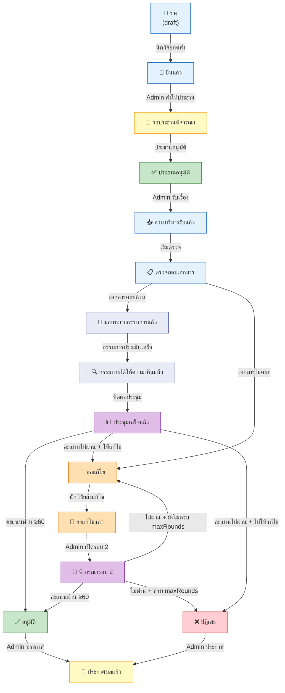

---

## 2) แผนภาพ Transition ตามที่ Admin เห็น (Read-only Map)

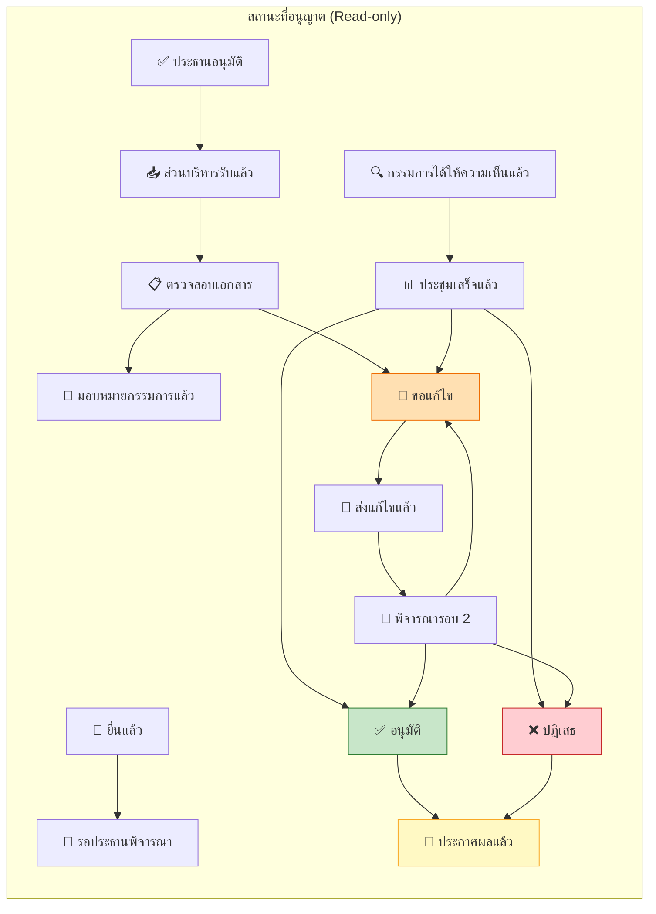

---

## 3) Simulation Path A — Happy Path (อนุมัติรอบ 1)

```mermaid
flowchart TD
    subgraph "เส้นทาง A: อนุมัติรอบแรก (คะแนนเฉลี่ย ≥ 60)"
        PA1["📝 ร่าง"] -->|"นักวิจัยกดส่ง\nSET submittedAt"| PA2["📄 ยื่นแล้ว"]
        PA2 -->|"Admin ส่งตรวจ"| PA3["🏫 รอประธานพิจารณา"]
        PA3 -->|"ประธานอนุมัติ\nSET facultyApprovedAt"| PA4["✅ ประธานอนุมัติ"]
        PA4 -->|"Admin รับเรื่อง\nSET officeReceivedAt"| PA5["📥 ส่วนบริหารรับแล้ว"]
        PA5 -->|"เริ่มตรวจเอกสาร"| PA6["📋 ตรวจสอบเอกสาร"]
        PA6 -->|"มอบหมาย 3 คน\nSET committeeIds"| PA7["👥 มอบหมายกรรมการแล้ว"]
        PA7 -->|"กรรมการประเมิน"| PA8["🔍 กรรมการได้ให้ความเห็นแล้ว"]
        PA8 -->|"ปิดประชุม (auto sync)"| PA9["📊 ประชุมเสร็จแล้ว"]
        PA9 -->|"เฉลี่ย 75 ≥ 60 ✅\nSET approvedAt"| PA10["✅ อนุมัติ"]
        PA10 -->|"Admin ประกาศ\nSET announcedAt"| PA11["📢 ประกาศผลแล้ว"]
    end

    style PA1 fill:#E3F2FD,stroke:#1565C0
    style PA10 fill:#C8E6C9,stroke:#2E7D32
    style PA11 fill:#FFF9C4,stroke:#F9A825
```

### Data Snapshot — Path A (แต่ละ Step)

```json
// Step 1: ร่าง
{ "currentStatus": "draft", "currentRound": 1, "committeeIds": [], "requiresRevision": false,
  "submittedAt": null, "facultyApprovedAt": null, "officeReceivedAt": null,
  "approvedAt": null, "rejectedAt": null, "announcedAt": null }

// Step 2: ยื่นแล้ว
{ "currentStatus": "submitted", "submittedAt": "2026-03-01T09:00:00" }

// Step 3: รอประธานพิจารณา
{ "currentStatus": "faculty_review_pending" }

// Step 4: ประธานอนุมัติ
{ "currentStatus": "faculty_approved", "facultyApprovedAt": "2026-03-05T14:30:00" }

// Step 5: ส่วนบริหารรับแล้ว
{ "currentStatus": "office_received", "officeReceivedAt": "2026-03-06T10:00:00" }

// Step 6: ตรวจสอบเอกสาร
{ "currentStatus": "document_checking" }

// Step 7: มอบหมายกรรมการแล้ว
{ "currentStatus": "assigned_to_committee", "committeeIds": ["C001", "C002", "C003"] }

// Step 8: กรรมการได้ให้ความเห็นแล้ว
{ "currentStatus": "under_review" }
// → ProposalReview: C001=75, C002=80, C003=70 (เฉลี่ย 75)

// Step 9: ประชุมเสร็จแล้ว (auto sync จาก Meeting)
{ "currentStatus": "meeting_completed" }

// Step 10: อนุมัติ
{ "currentStatus": "approved", "approvedAt": "2026-03-20T16:00:00" }

// Step 11: ประกาศผลแล้ว
{ "currentStatus": "announced", "announcedAt": "2026-03-25T09:00:00" }
```

---

## 4) Simulation Path B — แก้ไขแล้วผ่านรอบ 2

```mermaid
flowchart TD
    subgraph "เส้นทาง B: คะแนนไม่ผ่านรอบ 1 → แก้ไข → ผ่านรอบ 2"
        PB1["📝 ร่าง"] --> PB2["📄 ยื่นแล้ว"]
        PB2 --> PB3["🏫 รอประธานพิจารณา"]
        PB3 --> PB4["✅ ประธานอนุมัติ"]
        PB4 --> PB5["📥 ส่วนบริหารรับแล้ว"]
        PB5 --> PB6["📋 ตรวจสอบเอกสาร"]
        PB6 --> PB7["👥 มอบหมายกรรมการแล้ว"]
        PB7 --> PB8["🔍 กรรมการได้ให้ความเห็นแล้ว"]
        PB8 --> PB9["📊 ประชุมเสร็จแล้ว\nเฉลี่ย 55 ❌ (< 60)"]
        PB9 -->|"คะแนนไม่ผ่าน ขอแก้\nSET requiresRevision=true"| PB10["🔄 ขอแก้ไข\n(รอบ 1)"]
        PB10 -->|"นักวิจัยส่งแก้ไข\nSET requiresRevision=false"| PB11["📝 ส่งแก้ไขแล้ว"]
        PB11 -->|"Admin เปิดรอบ 2\nSET currentRound=2"| PB12["🔁 พิจารณารอบ 2"]
        PB12 -->|"เฉลี่ย 70 ≥ 60 ✅\nSET approvedAt"| PB13["✅ อนุมัติ"]
        PB13 -->|"ประกาศ\nSET announcedAt"| PB14["📢 ประกาศผลแล้ว"]
    end

    style PB9 fill:#FFCDD2,stroke:#C62828
    style PB10 fill:#FFE0B2,stroke:#EF6C00
    style PB11 fill:#FFE0B2,stroke:#EF6C00
    style PB12 fill:#E1BEE7,stroke:#7B1FA2
    style PB13 fill:#C8E6C9,stroke:#2E7D32
    style PB14 fill:#FFF9C4,stroke:#F9A825
```

### Data Snapshot — Path B (เฉพาะ Step ที่ต่างจาก Path A)

```json
// Step 9: ประชุมเสร็จแล้ว — คะแนน C001=70, C002=50, C003=45 เฉลี่ย 55 (ไม่ผ่าน)
{ "currentStatus": "meeting_completed", "currentRound": 1 }

// Step 10: ขอแก้ไข
{ "currentStatus": "revision_requested", "currentRound": 1, "requiresRevision": true }

// Step 11: ส่งแก้ไขแล้ว
{ "currentStatus": "resubmitted", "currentRound": 1, "requiresRevision": false }

// Step 12: พิจารณารอบ 2 — คะแนน C001=75, C002=70, C003=65 เฉลี่ย 70
{ "currentStatus": "second_round_review", "currentRound": 2 }

// Step 13: อนุมัติ (รอบ 2)
{ "currentStatus": "approved", "currentRound": 2, "approvedAt": "2026-04-10T14:00:00" }

// Step 14: ประกาศผลแล้ว
{ "currentStatus": "announced", "currentRound": 2, "announcedAt": "2026-04-15T09:00:00" }
```

---

## 5) Simulation Path C — ปฏิเสธ (ไม่ผ่านทั้ง 2 รอบ)

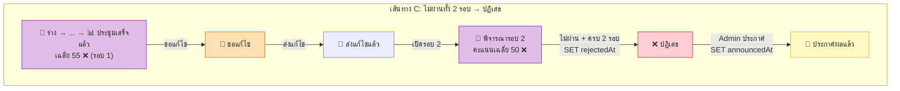

### Data Snapshot — Path C

```json
// Step: พิจารณารอบ 2 — คะแนน C001=55, C002=50, C003=45 เฉลี่ย 50
{ "currentStatus": "second_round_review", "currentRound": 2 }

// Step: ปฏิเสธ (ครบ maxRounds=2)
{ "currentStatus": "rejected", "currentRound": 2, "rejectedAt": "2026-04-10T14:00:00" }

// Step: ประกาศผลแล้ว
{ "currentStatus": "announced", "currentRound": 2, "announcedAt": "2026-04-15T09:00:00" }
```

---

## 6) Simulation Path D — ตรวจสอบเอกสาร → ขอแก้ไข (ก่อนถึงกรรมการ)

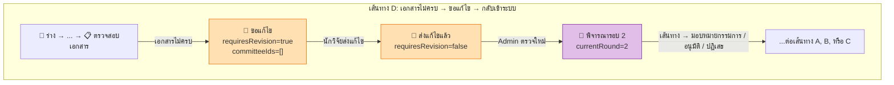

---

## 7) จำลองคะแนนกรรมการ — ผลต่อสถานะถัดไป

### สมมติ: กรรมการ 3 คน, คะแนนผ่าน ≥ 60

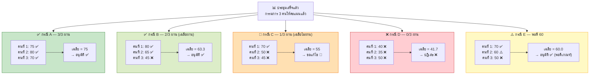

### ตารางจำลองคะแนน

```
┌─────────┬──────────┬──────────┬──────────┬──────────┬──────────┬──────────────────────┐
│ กรณี     │ กรรมการ 1  │ กรรมการ 2  │ กรรมการ 3  │ เฉลี่ย     │ ผ่าน?     │ สถานะถัดไป              │
├─────────┼──────────┼──────────┼──────────┼──────────┼──────────┼──────────────────────┤
│ A       │ 75       │ 80       │ 70       │ 75.0     │ ✅ ผ่าน   │ → อนุมัติ              │
│ B       │ 80       │ 65       │ 45       │ 63.3     │ ✅ ผ่าน   │ → อนุมัติ              │
│ C       │ 70       │ 50       │ 45       │ 55.0     │ ❌ ไม่ผ่าน │ → ขอแก้ไข (ถ้ารอบ<2)   │
│ D       │ 40       │ 35       │ 50       │ 41.7     │ ❌ ไม่ผ่าน │ → ปฏิเสธ               │
│ E       │ 70       │ 60       │ 50       │ 60.0     │ ✅ ผ่าน   │ → อนุมัติ (พอดีเกณฑ์)   │
├─────────┼──────────┼──────────┼──────────┼──────────┼──────────┼──────────────────────┤
│ F (ร2)  │ 75       │ 70       │ 65       │ 70.0     │ ✅ ผ่าน   │ → อนุมัติ (รอบ 2)      │
│ G (ร2)  │ 55       │ 50       │ 45       │ 50.0     │ ❌ ไม่ผ่าน │ → ปฏิเสธ (ครบ 2 รอบ)   │
└─────────┴──────────┴──────────┴──────────┴──────────┴──────────┴──────────────────────┘
```

---

## 8) วงรอบแก้ไข (Revision Loop — maxRounds=2)

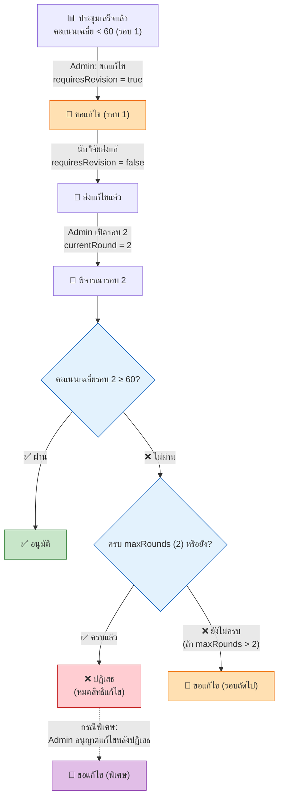

---

## 9) ใครทำอะไรได้ (Role-Action) — ภาษาไทย

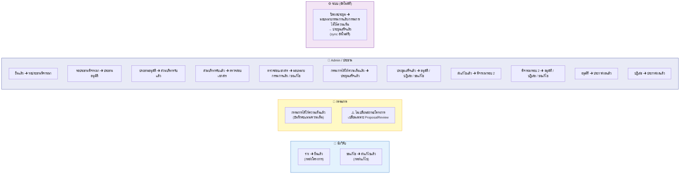

---

## 10) State Diagram — ภาพรวมทุก Transition พร้อม Field Changes

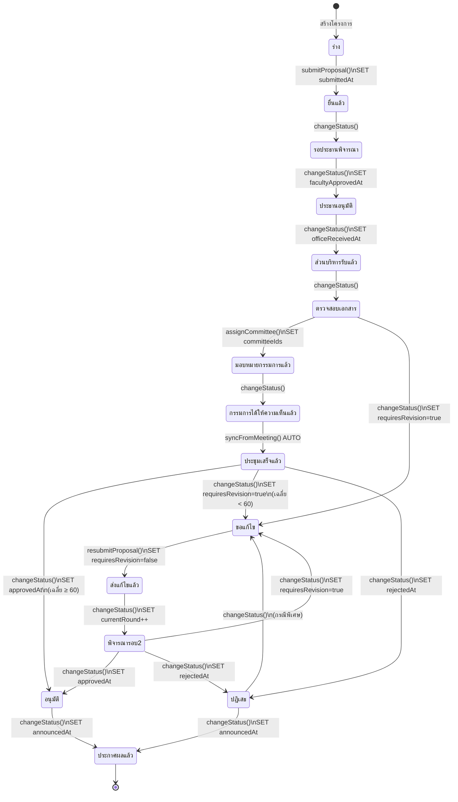

---

## 11) สรุป Field ที่เปลี่ยนในแต่ละ Transition

| จาก | ไป | Fields ที่เปลี่ยน | Function |
|-----|-----|-------------------|----------|
| ร่าง | ยื่นแล้ว | `currentStatus`, `submittedAt` | `submitProposal()` |
| ยื่นแล้ว | รอประธานพิจารณา | `currentStatus` | `changeProposalStatus()` |
| รอประธานพิจารณา | ประธานอนุมัติ | `currentStatus`, `facultyApprovedAt` | `changeProposalStatus()` |
| ประธานอนุมัติ | ส่วนบริหารรับแล้ว | `currentStatus`, `officeReceivedAt` | `changeProposalStatus()` |
| ส่วนบริหารรับแล้ว | ตรวจสอบเอกสาร | `currentStatus` | `changeProposalStatus()` |
| ตรวจสอบเอกสาร | มอบหมายกรรมการแล้ว | `currentStatus`, `committeeIds` | `assignCommittee()` |
| ตรวจสอบเอกสาร | ขอแก้ไข | `currentStatus`, `requiresRevision=true` | `changeProposalStatus()` |
| มอบหมายกรรมการแล้ว | กรรมการได้ให้ความเห็นแล้ว | `currentStatus` | `changeProposalStatus()` |
| กรรมการได้ให้ความเห็นแล้ว | ประชุมเสร็จแล้ว | `currentStatus` | `syncProposalStatusFromMeeting()` |
| ประชุมเสร็จแล้ว | อนุมัติ | `currentStatus`, `approvedAt` | `changeProposalStatus()` |
| ประชุมเสร็จแล้ว | ขอแก้ไข | `currentStatus`, `requiresRevision=true` | `changeProposalStatus()` |
| ประชุมเสร็จแล้ว | ปฏิเสธ | `currentStatus`, `rejectedAt` | `changeProposalStatus()` |
| ขอแก้ไข | ส่งแก้ไขแล้ว | `currentStatus`, `requiresRevision=false` | `resubmitProposal()` |
| ส่งแก้ไขแล้ว | พิจารณารอบ 2 | `currentStatus`, `currentRound++` | `changeProposalStatus()` |
| พิจารณารอบ 2 | อนุมัติ | `currentStatus`, `approvedAt` | `changeProposalStatus()` |
| พิจารณารอบ 2 | ปฏิเสธ | `currentStatus`, `rejectedAt` | `changeProposalStatus()` |
| พิจารณารอบ 2 | ขอแก้ไข | `currentStatus`, `requiresRevision=true` | `changeProposalStatus()` |
| อนุมัติ | ประกาศผลแล้ว | `currentStatus`, `announcedAt` | `changeProposalStatus()` |
| ปฏิเสธ | ประกาศผลแล้ว | `currentStatus`, `announcedAt` | `changeProposalStatus()` |
| ปฏิเสธ | ขอแก้ไข | `currentStatus`, `requiresRevision=true` | `changeProposalStatus()` |

---

## 12) Policy Validation — ตรวจสอบก่อนเปลี่ยนสถานะ

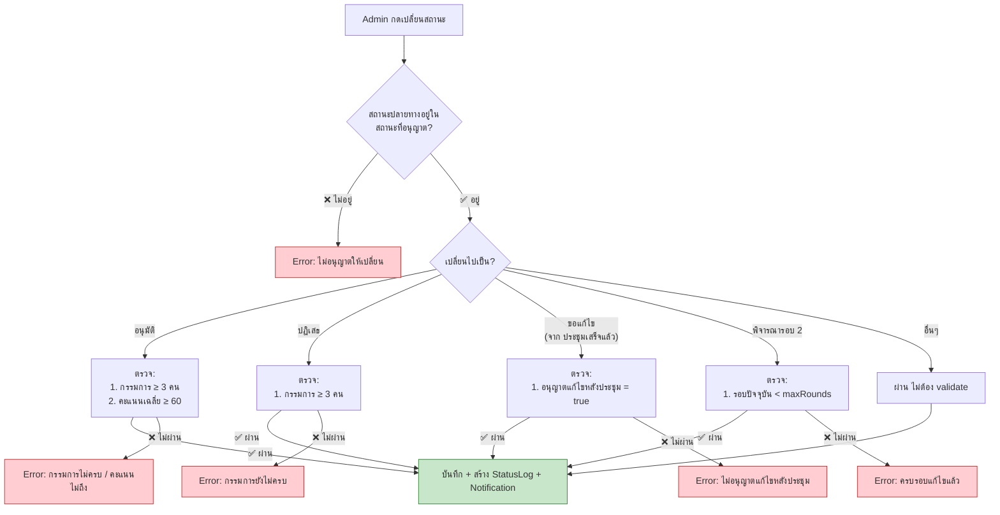

---

## 13) Timeline เปรียบเทียบ 3 เส้นทาง

```
เส้นทาง A: อนุมัติรอบ 1 (Happy Path)
═══════════════════════════════════════════════════════════════════
ร่าง → ยื่นแล้ว → รอประธานพิจารณา → ประธานอนุมัติ
  → ส่วนบริหารรับแล้ว → ตรวจสอบเอกสาร → มอบหมายกรรมการแล้ว
  → กรรมการได้ให้ความเห็นแล้ว → ประชุมเสร็จแล้ว → อนุมัติ → ประกาศผลแล้ว
                                                    ▲ เฉลี่ย 75 ≥ 60

เส้นทาง B: แก้ไขแล้วผ่านรอบ 2
═══════════════════════════════════════════════════════════════════
ร่าง → ... → ประชุมเสร็จแล้ว (เฉลี่ย 55 < 60)
  → ขอแก้ไข → ส่งแก้ไขแล้ว → พิจารณารอบ 2 (เฉลี่ย 70 ≥ 60)
  → อนุมัติ → ประกาศผลแล้ว

เส้นทาง C: ปฏิเสธ (ไม่ผ่านทั้ง 2 รอบ)
═══════════════════════════════════════════════════════════════════
ร่าง → ... → ประชุมเสร็จแล้ว (เฉลี่ย 55 < 60)
  → ขอแก้ไข → ส่งแก้ไขแล้ว → พิจารณารอบ 2 (เฉลี่ย 50 < 60)
  → ปฏิเสธ (ครบ 2 รอบ) → ประกาศผลแล้ว
```

---

## 14) สรุปแผนภาพทั้งหมดในเอกสารนี้

| แผนภาพ | Section | เนื้อหา |
|---------|---------|---------|
| Workflow หลัก | §1 | เส้นทางทั้งหมดตั้งแต่ร่างถึงประกาศผลแล้ว |
| Read-only Map | §2 | สถานะที่อนุญาตตามที่ Admin เห็น |
| Path A (อนุมัติรอบ 1) | §3 | Happy Path พร้อม Data Snapshot |
| Path B (แก้ไข → ผ่านรอบ 2) | §4 | Revision path พร้อม Data Snapshot |
| Path C (ปฏิเสธ) | §5 | ไม่ผ่านทั้ง 2 รอบ |
| Path D (เอกสารไม่ครบ) | §6 | ขอแก้ไขก่อนถึงกรรมการ |
| คะแนนกรรมการ | §7 | จำลอง 7 กรณีคะแนน + ตาราง |
| วงรอบแก้ไข | §8 | Revision loop (maxRounds=2) |
| Role-Action | §9 | ใครทำอะไรได้ที่สถานะไหน |
| State Diagram | §10 | ภาพรวมทุก transition + field changes |
| Transition Table | §11 | ตาราง 20 transitions |
| Policy Validation | §12 | ตรวจสอบก่อนเปลี่ยนสถานะ |
| Timeline | §13 | เปรียบเทียบ 3 เส้นทาง |
